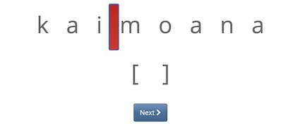

# Introduction
```{css, echo = FALSE}
#caption {
#      color: Grey;
#      font-size: 1.0em;
#}
#p.caption {
#  color: Grey;
#  font-size: 1.0em;
#}
```

This R Markdown file contains supplementary information and all the code used for data analysis and plotting. [Section 2][Data Preparation and Method] provides information on the stimuli and methodology of an experiment that aimed to get segmentations of Māori words by non-Māori speaking New Zealanders and non-New Zealanders. This section also includes the process for obtaining the Expert Rater data, and provides demographic details of the participants in the experiment. [Section 3][Modelling Procedure] provides information on the modelling process. [Section 4][Ungrammatical Model], [Section 5][ER Agreement Model], and [Section 6][Phonotactic Model] describe the three models used in the analysis.

```{r setup, message=FALSE, echo=FALSE}
library(pacman)
p_load(tidyverse, dplyr,
       magrittr, ggplot2, 
       lme4, reshape, 
       effects, quanteda,
       optimx, corpustools,
       ggeffects, ggpubr,
       kableExtra, readr,
       utils, cowplot,
       stringr, tidyr
       )
set.seed(235)

vif.mer <- function (fit) {
## adapted from rms::vif

  v <- vcov(fit)
  nam <- names(fixef(fit))

  ## exclude intercepts
  ns <- sum(1 * (nam == "Intercept" | nam == "(Intercept)"))
  if (ns > 0) {
    v <- v[-(1:ns), -(1:ns), drop = FALSE]
  nam <- nam[-(1:ns)]
  }

  d <- diag(v)^0.5
  v <- diag(solve(v/(d %o% d)))
  names(v) <- nam
  v
}

# The following code is from the corpustools library, in order to correctly run the simple good turing smoothing. Retrieved from: https://rdrr.io/cran/corpustools/src/R/smoothing.r

sgt <- function(freq){
  ff = data.frame(table(freq))
  ff$freq = as.numeric(as.character(ff$freq))
  ff = ff[ff$freq >= 1,]
  if (length(unique(ff$freq)) == 1) {
    warning('Smoothing is disabled, because all term frequencies (other than 0) are identical.')
    freq
  } else {
    sgt_v = sgt_values(ff$freq, ff$Freq)
    v = data.frame(r = c(0, sgt_v$r),
                   p = c(sgt_v$P0 / ff$Freq[1], sgt_v$p))
    ## check  "estimating the number of unseen species"
    ## use separate "ratio" and "p.ratio" in comp results
    v$p[match(freq, v$r)]
  }
}


can_smooth <- function(freq){
  ff = table(freq)
  ff = ff[!names(ff) == '0']
  if (length(unique(ff)) > 1) T else F
}

#' Laplace (i.e. add constant) smoothing
#'
#' 
#'
#' @param freq A numeric vector of term frequencies (integers).
#' @param add The added value
#'
#' @return A numeric vector with the smoothed term proportions
#' @examples
#' laplace(c(0,0,1,1,1,2,2,2,3,3,4,7,10))
#' @export
laplace <- function(freq, add=0.5){
  (freq + add) / sum(freq + add)
}

sgt_values <- function(r, Nr, conf=1.96) {
  N = sum(r * Nr)

  # averaging transforms
  Nrz = nrzest(r, Nr)

  # linear good-turing estimate
  f = stats::lm(log(Nrz) ~ log(r))
  coef = f$coefficients
  if (is.na(coef[2])) {
    warning('Could not properly calculate linear Good-Turing estimate.')
    coef[2] = 1
  }
  rst = rstest(r, coef)
  rstrel = rst / r

  ## turing estimates
  rtry = r == c(r[-1]-1, 0)
  rstarel = rep(0, length(r))
  rstarel[rtry] = (r[rtry]+1) / r[rtry] * c(Nr[-1], 0)[rtry] / Nr[rtry]

  ## switch from turing to LGT
  ## (use Turing estimates if significantly different from LGT estimates, and once this is not longer the case, use LGT estimates for every next r)
  ursd = rep(1, length(r))
  i = which(rtry)
  ursd[i] = (i+1) / Nr[i] * sqrt(Nr[i+1] * 1 + Nr[i+1] / Nr[i])

  switch = abs(rstrel - rstarel) * 1:length(r) / ursd <= conf
  if (any(switch) && !all(switch)) {
    switch[which(switch)[1]:length(switch)] = T
  }

  rstar = ifelse(switch, rstrel, rstarel) * r
  bigNprime = sum(Nr * rstar)
  pzero = Nr[1] / N
  p = (1 - pzero) * (rstar / bigNprime)

  list(P0 = pzero,
       r = r,
       p = as.numeric(p))
}

nrzest <- function(r, Nr) {
  d <- c(1, diff(r))
  dr <- c(0.5 * (d[-1] + d[ - length(d)]), d[length(d)])
  Nr/dr
}

rstest <- function(r, coef) {
  r * (1 + 1/r)^(1 + coef[2])
}

# read in data
nz_survey <- read_csv("docs/splitting_task_survey_195.csv", na = character()) # survey data for nzers for presenting their survey results
nonnz_polymoraic <- read_csv("docs/nonnz_polymoraic_ungram.csv", na = character()) # non nz polymoraic
nz_polymoraic <- read_csv("docs/nz_polymoraic_ungram.csv", na = character()) # nz polymoraic
```


# Data Preparation and Method

## Stimuli

The stimuli in the experimentation consist of a subset of the headwords in the Te Aka Dictionary [@moorfield] that occur at least once in a corpus consisting of the Māori Broadcast Corpus [@boyce2006] and the MAONZE corpus [@king2010maonze]. A set of categories were then associated to these items using the following procedure:

1. if a word started with "kai",  was a noun, was longer than three characters, and it was not a total reduplication "kaikai", then it was assigned the category "Kai". kai- is an agentive prefix in Māori.

2. If the word started with "whaka", or it started with whaka after removing a prefix "kai", then it was assigned the category of the causative prefix "Whaka".

3. If the word is listed in the dictionary as passive, it was assigned the category "Passive".

4. If the word is listed in the dictionary as a loanword, then it was assigned the category "Loanword".

5. If the word matches one of a set of regular expressions, it was assigned one of four reduplication categories: leftward partial reduplication with vowel lengthening ("Partial Reduplication (Left, Long)"), leftward reduplication with a short vowel or vowel shortening ("Partial Reduplication (Left, Short)"), rightward reduplication ("Partial Reduplication (Right)"), or total reduplication of a root ("Total Reduplication")

6. If the word ends in "Canga" or "nga", and if after removing this suffix the remaining string is a headword in the Te Aka dictionary, it was coded as "Nominal".

7. If treating short vowels as 1, and long vowels as 2, if the sum value of the word is 1, then it was coded as "Monomoraic".

8. If treating short vowels as 1, and long vowels as 2, if the sum value of the word is 2, then it was coded as bimoraic. If the word contains a long vowel or two adjacent vowels, it was coded as a "Bimoraic Monosyllable". The remainder were coded as "Bimoraic Disyllable".

9. If treating short vowels as 1, and long vowels as 2, if the sum value of the word is 3, then it was coded as "Trimoraic".

10. If treating short vowels as 1, and long vowels as 2, if the sum value of the word is greater than 3, then it was coded as "Polymoraic".

Any items that belonged to more than one category were removed. Any items that belonged to the "Kai" category, the "Bimoraic Monosyllable" category, or the "Monomoraic" category, they were removed. Any items that were coded as "Loanword" were removed.

When we conducted the morphological segmentation experiment, each participant received a random sample of these words, with each category balanced by the number of judgments per stimulis, per 200 participants, that we aimed for. For example, we targeted 15 judgments on average per Polymoraic item, given there would be 200 participants in the survey. The total set of Polymoraic stimuli was 1,337; consequently, we calculated the number of stimuli per participant at (15 * 1,337)/200 = 100.3,  rounding down to 100 stimuli per participant. The total count of stimuli, the number of judgments per 200, and the resulting sample size for each participant for each category is shown in Table \@ref(tab:tab1).

```{r tab1}
tibble(
  Category = c("Polymoraic", "Bimoraic Disyllable", "Whaka", "Passive", "Nominal", "Trimoraic", "Partial Redup. (Left, Long)", "Partial Redup. (Left, Short)", "Partial Redup. (Right)", "Total Redup."),
  `Total Count` = c(1337, 625, 297, 526, 248, 473, 40, 193, 302, 440),
  `Judgments Per 200` = c(15, 12, 8, 8, 8, 8, 8, 8, 8, 8),
  `Sample Size ` = c(100, 38, 12, 21, 10, 19, 2, 8, 12, 18)
) %>%
  kbl(caption = "Size of Each Category, with Judgmments Per 200 Participants and Sample Size") %>%
  kable_styling()
  
```

For the statistical analysis, only the polymoraic set is used. Furthermore, there were 20 words that at least one of the [Expert Raters] did not provide an analysis for, and therefore were unsuitable for statistical analysis. Consequently, for the Polymoraic set, there were a total of 1,317 words available for analysis.

## Experimental Methodology

The experiment was distributed as a web interface that was accessible through a URL link. Participants were required to read an information sheet and agree to a consent form before beginning the experiment. The experiment used an interface that was identical to that used in Needle [-@needle2018gradient]. Following the experiment was a questionnaire. For the New Zealand-based Participants, the experiment was distributed through online advertisements on Facebook. For the non-New Zealand paticipants, the experiment was distributed through Twitter.

All experimentation was carried out with full ethical clearance from the University of Canterbury.

Participants were first presented with instructions on what they were expected to do. They were introduced to the concept of morphological complexity in English, using "careful" and "disagreement" as examples of morphologically complex forms, and "yellow" as an example of a morphologically simple form.

Participants were then told they would see real Māori words in this experiment, and were instructed to "split each word into parts". Participants were given an example using the word "kaimoana", which includes two relatively transparent morphemes in Māori to Non-Māori speakers: <it>kai</it> "food"; <it>moana</it> "sea". Participants were instructed to click on any boundaries that they wish to assign, or to click a box under the word if they wished to leave the word unsegmented. Participants were able to make more than one boundary, if they wished, including phonotactically ungrammatical boundaries in Māori (i.e. following a consonant).

Image \@ref(fig:img1) is an example that was provided to the participants. The vertical red bar is a placed boundary. Clicking this bar again would remove the boundary. Clicking the "[ ]" box underneath the word indicates a decision not to segment the word.

```{r img1, out.width="100%", out.height="100%", fig.cap="Splitting Example Provided to Participants"}

```

The experiment was conducted twice. First, the experiment was sent to New Zealanders, who did not speak Māori. Second, the experiment was sent to non-New Zealanders who had never been to New Zealand. 

## Data Filtering and Preparation

There were a total of 307 participants that engaged with the first experiment. The filtering process is shown below. Note that the criteria for filtering partly made use of the questionnaire.

55 participants were removed that did not complete the experiment.
10 'participants' were removed after it was determined that it was the same user completing the experiment with different e-mail addresses.
8 'participants' were removed after it was determined it was another user completing the experiment with different e-mail addresses.
5 participants were removed who completed the experiment but not the questionnaire.
14 participants were removed who identified their Māori language skills as 'fairly well' or greater.
14 participants were removed who had lived outside of NZ for more than a year.
2 participants were removed who did not speak English as a first language.
4 participants were removed who stated they did not learn their first language in New Zealand, and lived in their current location for less than 10 years (in order to filter out people who likely do not speak New Zeland English)

This resulted in 195 participants. 

With respect to the second experiment, there were a total of 63 non-New Zealanders who engaged with the experiment. Of these, 20 did not complete the experiment, resulting in 43 participants. There was no further data filtering.

```{r dataprep, message=FALSE}
nz_merge <- nz_polymoraic %>%
  mutate(
    NZ = TRUE,
    er_inference_boundary = er_inference_boundary %>%
      str_replace_all("no", "No") %>%
      str_replace_all("disagree", "Disagree") %>%
      str_replace_all("yes", "Yes"),
    #item = item %>% as.character() %>% as.factor()
  ) %>%
  dplyr::select(participant_boundary, initial_bimora, er_inference_boundary, prior_long_vowel, vowel_boundary, item, workerId, NZ, is_foot, stimID, ungrammatical, bigrm, boundary) 

merged_set <- nonnz_polymoraic %>%
  mutate(
    NZ = FALSE,
    er_inference_boundary = er_inference_boundary %>%
      str_replace_all("no", "No") %>%
      str_replace_all("disagree", "Disagree") %>%
      str_replace_all("yes", "Yes"),
    #item = item %>% as.character() %>% as.factor()
  ) %>%
  dplyr::select(participant_boundary, initial_bimora, er_inference_boundary, prior_long_vowel, vowel_boundary, item, workerId, NZ, is_foot, stimID, ungrammatical, bigrm, boundary)%>%
  bind_rows(nz_merge)


merged_set$item <- factor(merged_set$item)

merged_set$er_inference_boundary <- factor(merged_set$er_inference_boundary, levels = c("No", "Disagree", "Yes")) 

merged_set$vowel_boundary <- factor(merged_set$vowel_boundary, levels = c("TRUE", "FALSE"), labels = c("Vowel Boundary", "Cons Boundary"))
merged_set$prior_long_vowel <- factor(merged_set$prior_long_vowel, levels = c("TRUE", "FALSE"), labels = c("Prior Long V.", "Prior Short V."))
merged_set$participant_boundary <- as.factor(merged_set$participant_boundary)
merged_set$is_foot <- factor(merged_set$is_foot, levels = c("TRUE", "FALSE"), labels = c("Foot", "Nonfoot"))
merged_set$initial_bimora <- factor(merged_set$initial_bimora, levels = c("TRUE", "FALSE"), labels = c("Init. Bimora", "Non Init. Bimora"))
merged_set$NZ <- factor(merged_set$NZ, levels = c("TRUE", "FALSE"), labels = c("NZ", "Non NZ"))
merged_set$workerId <- as.factor(merged_set$workerId)
merged_set$ungrammatical <- factor(merged_set$ungrammatical, levels = c("FALSE", "TRUE"), labels = c("Grammatical", "Ungrammatical"))

```

## Questionnaire and New Zealand-Based Participant Demographics

Following the experiment, the New Zealand-based participants were asked to fill out a questionnaire. This questionnaire consists of 27 questions:

1. How well are you able to speak Maori?  
   * Not at all (0)  
   * No more than a few words for phrases (1)  
   * Not very well (2)  
   * Fairly well (3)  
   * Well (4)  
   * Very well (5)

2. How well are you able to understand/read Maori?  
   * Not at all (0)  
   * No more than a few words or phrases (1)  
   * Not very well (2)  
   * Fairly well (3)  
   * Well (4)  
   * Very well (5)

3. What is the highest level of education you have studied Te Reo Māori?  
   * Never studied it  
   * At postgraduate level in university  
   * At undergraduate level in university  
   * At high school  
   * At primary/intermediate school

4. Have you ever taken a university-level course in linguistics?  
   * Yes, I have taken a linguistics course  
   * No, but I have studied a language at university  
   * No, I have no university-level study in linguistics or languages

5. Which age group do you belong to?  
   * 18-29  
   * 30-39  
   * 40-49  
   * 50-59  
   * +60

6. Please state your gender.
  * Woman
  * Man
  * Non-Binary
  * prefer not to say
 
7. Please state your ethnicity.
  * European/Pākehā
  * Māori
  * Pacific Peoples
  * Asian
  * Middle Eastern/Latin American/African
  * Other

8. Were you born in New Zealand?  
   * Yes  
   * No

9. Which island have you spent more time on?  
   * North Island  
   * South Island  
   * Equal measure on both

10. In the time since you were 7, have you ever lived outside of NZ for a period of more than a year?  
    * Yes  
    * No

11. In which region have you spent the largest amount of time since you were 7?  
    * Northland  
    * Auckland  
    * Waikato  
    * Bay of Plenty  
    * Gisborne  
    * Hawke's Bay  
    * Taranaki  
    * Wanganui  
    * Manawatu  
    * Wairarapa  
    * Wellington  
    * Nelson Bays  
    * Marlborough  
    * West Coast  
    * Canterbury  
    * Timaru  
    * Oamaru  
    * Otago  
    * Southland  
    * Overseas

12. Your highest education is:  
    * High School  
    * Certificate or Diploma
    * Undergraduate Degree  
    * Postgraduate Degree

13. How often do you think you are exposed to Māori language in your daily life, by means of Māori radio, Māori TV, online media?  
    * Less than once a year (1)  
    * Less than once a month (2)  
    * Less than once a week (3)  
    * Less than once a day (4)  
    * Multiple times a day (5)

14. How often do you think you are exposed to Māori language in your daily life, in conversation at work, at home, in social settings?  
    * Less than once a year (1)  
    * Less than once a month (2)  
    * Less than once a week (3)  
    * Less than once a day (4)  
    * Multiple times a day (5)

15. In the past five years, have you had any children living with you who have attended preschool or primary school in New Zealand?  
    * Yes
    * No

16. Please tick all boxes that apply.  
    * I can give a mihi in Māori  
    * I can sing a few songs in Māori  
    * I can sing a NZ national anthem in Māori  
    * I know how to say some basic phrases (e.g., My name is..., I'm from...) in Māori  
    * I know how to say some commands (e.g., Sit down / Come here) in Māori  
    * I know how to say some greetings in Māori  
    * I know how to say some numbers in Māori  
    * I know how to say some body parts in Māori  
    * I know how to say some colors in Māori

17. What region of New Zealand do you live in currently? (Please choose “overseas” if you are living outside of New Zealand).  
    * Northland  
    * Auckland  
    * Waikato  
    * Bay of Plenty  
    * Gisborne  
    * Hawke's Bay  
    * Taranaki  
    * Wanganui  
    * Manawatu  
    * Wairarapa  
    * Wellington  
    * Nelson Bays  
    * Marlborough  
    * West Coast  
    * Canterbury  
    * Timaru  
    * Oamaru  
    * Otago  
    * Southland  
    * Overseas

18. How long have you been living there? 
    * Less than six months
    * 1 year
    * 2 years
    * 3 years
    * 4 years
    * 5 years
    * 6 years
    * 7 years
    * 8 years
    * 9 years
    * 10+ years
    * 20+ years
    * 30+ years
    * 40+ years
    * 50+ years
    

19. Please state your first language (the language you speak/use most of your time).  *(free response)*  

20. What country were you living in when you first learned this language?  *(free response)*  

21. Please list any other languages that you can speak well.  *(free response)*  

22. Have you lived in Hawaii?  
    * Yes  
    * No

23. Do you speak/understand any Polynesian languages such as Hawaiian, Tahitian, Sāmoan, or Tongan?  
    * Yes  
    * No

24. If you replied yes to question 22, please state the language you know.  *(free response)*  

25. How do you feel about the following statement: “I have a lot of respect for people who can speak Māori fluently.”  
    * Strongly disagree  
    * Somewhat disagree  
    * Neither agree nor disagree  
    * Somewhat agree  
    * Strongly agree

26. How do you feel about the following statement: “Some Māori language education should be compulsory in school for all children.”  
    * Strongly disagree  
    * Somewhat disagree  
    * Neither agree nor disagree  
    * Somewhat agree  
    * Strongly agree
    
27. Did you participate in an online Māori word rating experiment earlier this year?
    * yes
    * no

Some results of this post-experimental survey for the New Zealand-based participants are shown in figure \@ref(fig:survey). While Māori proficiency was generally low (with 76.4% scoring 2 or below), participants did have some basic knowledge of Māori skills (this included skills such as self-introduction, songs,  basic numerals etc.)

```{r survey, fig.cap="Key survey results for the New Zealand-based Participants", warning=FALSE}
data <- nz_survey
# Basic knowledge of Māori
DataML <- unique(data[,c("maoriList","workerId")]); DataML$maoriList <- as.factor(DataML$maoriList)
DataMLT <- as.data.frame(table(DataML$maoriList)); names(DataMLT) <- c("maoriList","freq")
FigS1DataML <- ggplot(DataML, aes(x=maoriList,color=maoriList,fill=maoriList)) +
  geom_bar(aes(),size=.1,show.legend=F) + 
  geom_text(data=DataMLT, aes(x=maoriList,y=freq,label=freq), color="black", vjust=-0.5,size=3) + 
  labs(x="Basic knowledge of Māori",y="Number of participants") + 
  coord_cartesian(ylim=c(0, 50)) +
  theme_classic() +
  theme(
    panel.background = element_blank()
  ) +
  theme(axis.title.y = element_blank())
remove(DataML, DataMLT)

# Māori proficiency 
DataMP <- unique(data[,c("maoriProf","workerId")]); DataMP$maoriProf <- as.factor(DataMP$maoriProf)
DataMPT <- as.data.frame(table(DataMP$maoriProf)); names(DataMPT) <- c("maoriProf","freq")
FigS1DataMP <- ggplot(DataMP, aes(x=maoriProf, color=maoriProf, fill=maoriProf)) + 
  geom_bar(aes(),size=.1,show.legend=F) + 
  geom_text(data=DataMPT, aes(x=maoriProf,y=freq,label=freq), color="black", vjust=-0.5,size=3) + 
  labs(x="Māori proficiency",y="Number of participants") + 
  coord_cartesian(ylim=c(0, 140)) +
  theme_classic() +
  theme(
    panel.background = element_blank()
  )+
  theme(axis.title.y = element_blank())
remove(DataMP, DataMPT)

# Exposure to Māori
DataME <- unique(data[,c("maoriExpo","workerId")]); DataME$maoriExpo <- as.factor(DataME$maoriExpo)
DataMET <- as.data.frame(table(DataME$maoriExpo)); names(DataMET) <- c("maoriExpo","freq")
FigS1DataME <- ggplot(DataME, aes(x=maoriExpo, color=maoriExpo, fill=maoriExpo)) + 
  geom_bar(aes(),size=.1,show.legend=F) + 
  geom_text(data=DataMET, aes(x=maoriExpo,y=freq,label=freq), color="black", vjust=-0.5,size=3) +
  labs(x="Māori exposure",y="Number of participants") + 
  coord_cartesian(ylim=c(0, 50)) +
  theme_classic() +
  theme(
    panel.background = element_blank()
  )+
  theme(axis.title.y = element_blank())
remove(DataME, DataMET)

# Gender
DataGender <- unique(data[,c("gender","workerId")])
DataGenderT <- as.data.frame(table(DataGender$gender)); names(DataGenderT) <- c("gender","freq")
FigS1DataGender <- ggplot(DataGender, aes(x=gender,color=gender,fill=gender)) + 
  geom_bar(aes(),size=.1,show.legend=F) + 
  geom_text(data=DataGenderT, aes(x=gender,y=freq,label=freq), color="black", vjust=-0.5,size=3) +
  labs(x="Gender",y="Number of participants") + 
  coord_cartesian(ylim=c(0, 180)) +
  theme_classic() +
  theme(
    panel.background = element_blank()
  )+
  theme(axis.title.y = element_blank())
remove(DataGender, DataGenderT)

# Age
DataAge <- unique(data[,c("age","workerId")]); DataAge$age <- factor(DataAge$age, levels=c("18-29", "30-39", "40-49", "50-59", "60"), labels=c("18-29", "30-39", "40-49", "50-59", ">60"))
DataAgeT <- as.data.frame(table(DataAge$age)); names(DataAgeT) <- c("age","freq"); DataAgeT$age <- factor(DataAgeT$age, levels=c("18-29", "30-39", "40-49", "50-59", ">60"))
FigS1DataAge <- ggplot(DataAge, aes(x=age,color=age,fill=age)) + 
  geom_bar(aes(),size=.1,show.legend=F) + 
  geom_text(data=DataAgeT, aes(x=age,y=freq,label=freq), color="black", vjust=-0.5,size=3) + 
  labs(x="Age group",y="Number of participants") + 
  coord_cartesian(ylim=c(0, 80)) +
  theme_classic() +
  theme(
    panel.background = element_blank()
  )+
  theme(axis.title.y = element_blank())
remove(DataAge, DataAgeT)

# Education
DataEducation <- unique(data[,c("education","workerId")])
DataEducation$education <- factor(DataEducation$education, levels=c("certificate or diploma", "high school","undergraduate","graduate"), labels=c("cert./diploma", "high school", "undergrad.", "graduate"))
DataEducationT <- as.data.frame(table(DataEducation$education)); names(DataEducationT) <- c("education","freq"); DataEducationT$education <- factor(DataEducationT$education, levels=c("cert./diploma", "high school", "undergrad.", "graduate"))
FigS1DataEducation <- ggplot(DataEducation, aes(x=education,color=education,fill=education)) + 
  geom_bar(aes(),size=.1,show.legend=F) + 
  geom_text(data=DataEducationT, aes(x=education,y=freq,label=freq), color="black", vjust=-0.5,size=3) + 
  labs(x="Highest qualification",y="Number of participants") + 
  coord_cartesian(ylim=c(0, 100)) + 
  theme_classic() +
  theme(
    panel.background = element_blank()
    ) +
  theme(axis.text.x = element_text(angle = 15, vjust = 0.5, hjust=0.5,))+
  theme(axis.title.y = element_blank())
remove(DataEducation, DataEducationT)

# Place
DataPlace <- unique(data[,c("island","workerId")]); DataPlace$island <- factor(DataPlace$island, levels=c("north","south", "equal"), labels=c("North Island", "South Island", "Equal"))
DataPlaceT <- as.data.frame(table(DataPlace$island)); names(DataPlaceT) <- c("island","freq"); DataPlaceT$island <- factor(DataPlaceT$island, levels=c("North Island", "South Island", "Equal"))
FigS1DataPlace <- ggplot(DataPlace, aes(x=island, color=island, fill= island)) + 
  geom_bar(aes(),size=.1,show.legend=F) +
  geom_text(data=DataPlaceT,aes(x=island,y=freq,label=freq), color="black", vjust=-0.5,size=3) + 
  labs(x = "Place within NZ", y = "Number of participants") + 
  coord_cartesian(ylim=c(0, 140)) +
  theme_classic() +
  theme(
    panel.background = element_blank()
  ) +
  theme(axis.text.x = element_text(angle = 15, vjust = 0.5, hjust=0.5))+
  theme(axis.title.y = element_blank())
remove(DataPlace, DataPlaceT)

# Ethnicity
DataEthnicity <- unique(data[,c("ethnicity1","workerId")]); DataEthnicity$ethnicity1 <- factor(DataEthnicity$ethnicity1, levels=c("Non M","M"), labels=c("Non-Māori", "Māori"))
DataEthnicityT <- as.data.frame(table(DataEthnicity$ethnicity1)); names(DataEthnicityT) <- c("ethnicity1","freq"); DataEthnicityT$ethnicity1 <- factor(DataEthnicityT$ethnicity1, levels=c("Non-Māori", "Māori"))
FigS1DataEthnicity <- ggplot(DataEthnicity, aes(x=ethnicity1, color=ethnicity1, fill= ethnicity1)) + 
  geom_bar(aes(),size=.1,show.legend=F) +
  geom_text(data=DataEthnicityT,aes(x=ethnicity1,y=freq,label=freq), color="black", vjust=-0.5,size=3) + 
  labs(x = "Ethnicity", y = "Number of participants") + 
  coord_cartesian(ylim=c(0, 180)) +
  theme_classic() +
  theme(
    panel.background = element_blank()
  )+
  theme(axis.title.y = element_blank())
remove(DataEthnicity, DataEthnicityT)

# Value Maori 
DataMA <- unique(data[,c("maoriAttitude","workerId")])  %>%
  filter(!is.na(maoriAttitude))
DataMA$maoriAttitude <- factor(DataMA$maoriAttitude, levels = c("NA", "4", "5", "6", "7", "8", "9", "10")) # one NA in data
DataMAT <- as.data.frame(table(DataMA$maoriAttitude)); names(DataMAT) <- c("maoriAttitude","freq") 
FigS1DataMA <- ggplot(DataMA, aes(x=maoriAttitude, color=maoriAttitude, fill=maoriAttitude)) + 
  geom_bar(aes(),size=.1,show.legend=F) + 
  geom_text(data=DataMAT, aes(x=maoriAttitude,y=freq,label=freq), color="black", vjust=-0.5,size=3) + 
  labs(x="Attitude Toward Māori",y="Number of participants") + 
  coord_cartesian(ylim=c(0, 140)) +
  theme_classic() +
  theme(
    panel.background = element_blank()
  ) +
  theme(axis.title.y = element_blank())
#remove(DataMA, DataMAT)

survey_plot <- ggarrange(FigS1DataML, FigS1DataGender, FigS1DataPlace, FigS1DataMP, FigS1DataAge, FigS1DataEducation, FigS1DataME, FigS1DataEthnicity, FigS1DataMA,ncol = 3, nrow = 3)
survey_plot

#ggsave("figs/survey.jpg", survey_plot, width = 8, height = 6, dpi = 750)

#remove(FigS1DataML, FigS1DataGender, FigS1DataPlace, FigS1DataMP, FigS1DataAge, FigS1DataEducation, FigS1DataME, FigS1DataEthnicity, FigS1DataMA)

```

The dataset used for statistical analysis in this paper consists of all possible segmentable positions for each stimulus that was sampled to the participants. The following variables were coded:

- item: an integer code for each of the 1,317 polymoraic stimuli.
- workerId: an individual code assigned to each of the 189 participants.
- boundary: the  index of the character that the possible split follows.
- participant_boundary: whether the participant segmented in this position (true/false)
- initial_bimora: whether this position is two moras from the beginning of the word (true/false)
- er_inference_boundary: whether both ERs segmented this position ("yes"), one ER segmented this position but the other did not ("disagree"), or no ERs segmented this position ("no").
- prior_long_vowel: whether the character prior to this position is a long vowel (true/false)
- vowel_boundary: whether the character after this position is a vowel (true/false)
- eng_score: The English phonotactic score for the bigram that the boundary is between, defined below.
- mao_score_short: The Māori vowel-length neutralised phonotactic score for the bigram that the boundary is between, defined below.

Table \@ref(tab:tab2) provides some example rows of the dataset.

<div align="left">
```{r tab2, message=FALSE}
head(merged_set) %>%
  select(item, workerId, boundary, participant_boundary, initial_bimora, er_inference_boundary, prior_long_vowel, vowel_boundary) %>%
  kbl(caption = "Example Rows of the Dataset") %>%
  kable_styling(bootstrap_options = "striped", full_width = F)
```
</div>

## Phonotactic Scores

In order to determine the sensitivity of New Zealand-based and non-New Zealand based participants to English and Māori phonotactics, we devised phonotactic complexity scores for each bigram in the experimental results dataset. Since the experiment is a task in processing morphological composition, ngram models were developed from Māori and English morphological databases. The Māori phonotactic scores were derived from a set of morphs developed from the use of an edited version of Morfessor [@virpioja2013morfessor], which was trained on the Expert Rater segmentations. The English phonotactic scores were derived from a set of morphs from the CELEX database [@van1990celex]. This dataset is described in footnote one in @hay2004speech. Bigrams were retrieved from this dataset, and for each unique bigram its score was calculated as its negative base-2 log conditional probability [@goldsmith2012information; @pimentel2020phonotactic; @brown1992estimate]. In other words, for a bigram `ab`:
  
  score(ab) = -log2(frequency(ab)/frequency(a))
  
  Simple Good-turing smoothing [@gale1995good] was used to provide scores for bigrams in the experimental results dataset that were absent in the English or Māori morph datasets.
  
For the Māori score, two measures were derived. The first preserved length contrasts in the vowels, while the second neutralized length contrast.

```{r phon_score, message=FALSE}
merged_set <- merged_set %>%
  mutate(
        bigrm_nocap = bigrm %>% 
      str_replace_all("N", "ng") %>%
      tolower() %>%
      str_replace_all("ng", "N")
  )
  
maori_bigram_tab <- read_csv("docs/maori_bigram_tab.csv")
eng_bigram_tab <- read_csv("docs/eng_bigram_tab.csv")
maori_bigram_tab_nolong <- read_csv("docs/maori_bigram_tab_nolong.csv")

merged_set <- merged_set %>%
  merge(
    maori_bigram_tab, by = "bigrm"
  ) %>%
  merge(
    eng_bigram_tab, by = "bigrm_nocap"
  ) %>%
  merge(
    maori_bigram_tab_nolong, by = "bigrm_nocap"
  )
```


Figure \@ref(fig:maomaoplot) compares the sensitivity of the Māori long/short vowel score and the Māori length-neutralised score. It appears that the length-neutralised score is more sensitive to the New Zealand-based participants judgments. Consequently, we use the length-neutralised score.

```{r maomaoplot, fig.cap="Comparison of Māori long vowel and Māori short vowel scores in the New Zealand-based Participant Data", warning=FALSE, message=FALSE} 
phon_plot1 <- merged_set %>%
  filter(NZ == "NZ") %>%
  pivot_longer(c(mao_score, mao_score_nolong), names_to="mao_name", values_to="mao_scoring") %>%
  mutate(
    mao_name = factor(mao_name, levels = c("mao_score", "mao_score_nolong"), labels = c("Māori Score (Long)", "Māori Score (Short Only)"))
  ) %>%
  ggplot(aes(x = mao_scoring, y = as.integer(participant_boundary)-1, color = mao_name, fill = mao_name)) +
  geom_point(alpha=0.01) +
  geom_smooth(method="glm", method.args = list(family = "binomial")) +
  theme_minimal() +
  ylim(0, 1) +
  xlab("Score") +
  ylab("Segment Probability") +
  theme(legend.title = element_blank())
  
ggarrange(phon_plot1)
```

Figure \@ref(fig:engmaoplot) compares the English phonotactic scores and the (short) Māori phonotactic scores of each unique bigram in the dataset.

```{r engmaoplot, fig.cap="Comaprison of English Phonotactic Scores and (Short Vowel) Māori Phonotactic Scores", message=FALSE}
phon_plot2 <- merged_set %>%
  dplyr::select(bigrm, eng_score, mao_score_nolong) %>%
  distinct() %>%
  ggplot(aes(x = mao_score_nolong, y = eng_score)) +
  geom_point(alpha=0.2) +
  geom_smooth(method="lm", color = "blue", fill = "red") +
  theme_minimal() +
  scale_x_continuous(breaks=seq(0, 9, by=3)) +
  scale_y_continuous(breaks=seq(0, 12, by=3)) +
  xlab("Māori Score") +
  ylab("English Score")

ggarrange(phon_plot2)
#ggsave("docs/scores_compare.jpg", width = 2, height = 2, dpi=800)
```


## Expert Raters

Two fluent Māori speakers (the "Expert Raters", henceforth ERs) were tasked to provide morphological segmentations for words in the <i>Te Aka</i> dictionary [@moorfield]. The ERs either segmented words into parts, or chose to not segment a word. The process of retrieving the segmentations by the ERs involved creating shuffled lists of words from the Te Aka dictionary, and tasking the ERs with placing periods '.' between parts for each word on these shuffled lists. For some words, the ERs did not know how to analyse it, and so decided not to provide an analysis.

The words that the ERs segmented consisted of items that did not have a straightforward morphological analysis. Items that: (i) had a transparent morphological structure; (ii) were total reduplications; (iii) of a size that the ERs were unlikely to split, were procedurally assigned segmentations through inference. The following items received inferred segmentations:

1. Words identified as containing a passive suffix: -Cia, -Cina, -na, -ina, etc. were segmented at the position prior to the passive suffix if the base occured in the dictionary: arumia -> aru/mia
2.  Words identified as containing the causative prefix whaka- were segmented following this prefix if the base occurred in the dictionary: whakarongo -> whaka/rongo
3.  Words identified as containing the agentive prefix kai- were segmented following this prefix if the base occurred in the dictionary: kaitiaki -> kai/tiaki
4.  Words identified as containing the nominalising suffix -Canga, -nga, were segmented at the position prior to the sufix if the base occurred in the dictionary: akomanga -> ako/manga
5. Total reduplications longer than two moras were segmented between the base and the reduplicant: kurakura -> kura/kura
6. Words that were two moras or fewer were unsegmented, if they were not also total reduplicants: ako -> ako, ki -> ki, but mimi was rated by the ERs.

Excluded from this set of inferred segmentations were words that appeared complex but permitted morphology that was inconsistent with this complexity, e.g. if a word beginning with "kai"could also receive "whaka" (which is incompatible with a following agentive prefix), then it was rated by the ERs. Furthermore, in cases where an affix occured with a morphologically complex form (e.g. a morphologically complex verb occurring with a passive or nominal suffix), the morphological composition of the base was inferred from the relevant ERs split of that base.

In all, the dataset of ER judgments and inferred splits consists of 19,595 words. We filtered out words that neither or only one ER provided an analysis for, resulting in 18,630 words.


Plot \@ref(fig:fig3) below shows the distribution of Expert Rater segmentations in the polymoraic dataset of 1,317 words. Plot a shows the number of words that both ERs decided to segment, against those that neither ER segmented. There are only 64 words that the ERs decided not to segment. Plot b shows the number of segmentations based on whether the position segments the initial bimora of the word. 842/923 (91.2%) of initial bimora positions are segmented, while only 3% of non-initial bimora positions are segmented. Plot c shows that of the 715 segmentable positions prior to a vowel, 14.3\% are segmented, while 44.9\% of the 1,752 segmentable positions prior to a consonant are segmented. Plot d shows that of the 398 segmentable positions with a prior long vowel, 78.9\% were segmented by the ERs. In contrast, only 27.8\% of segmentable positions with prior short vowels were segmented.

Plot \@ref(fig:fig3) shows that: (i) the ERs preferentially segmented the initial bimora of the words; (ii) they had a higher probability of segmenting prior to a consonant; (iii) they tended to segment following a long vowel.
 
```{r fig3, fig.cap="Segmentation Trends by the Expert Raters: a) the number of polymoraic words that were segmented or not segmented; b) the number of segmentations by whether the boundary followed the initial bimora of the word; c) the number of segmentations by whether they preceded a vowel or a consonant; d) the number of segmentations by whether they followed a long or short vowel", message=FALSE}
vjust_val = -0.25

no_disagree <- nz_polymoraic %>%
  group_by(item) %>%
  mutate(has_disagree = "disagree" %in% er_inference_boundary) %>%
  filter(!has_disagree) %>%
  ungroup() %>%
  filter(!ungrammatical)

er_plot1_tab <- no_disagree %>%
  select(item, er_inference_boundary) %>%
  distinct() %>%
  group_by(item) %>%
  mutate(is_split = ("yes" %in% er_inference_boundary) %>%
           factor(levels = c("TRUE", "FALSE"), labels = c("Word Segmented", "Word Unsegmented"))) %>%
  select(-er_inference_boundary) %>%
  distinct() %>%
  ungroup() %>%
  select(is_split) %>%
  table(dnn = "is_split") %>%
  data.frame() %>%
  mutate(Proportion = Freq/sum(Freq))
er_plot1 <- no_disagree %>%
  select(item, er_inference_boundary) %>%
  distinct() %>%
  group_by(item) %>%
  mutate(is_split = ("yes" %in% er_inference_boundary) %>%
           factor(levels = c("TRUE", "FALSE"), labels = c("Word Segmented", "Word Unsegmented"))) %>%
  select(-er_inference_boundary) %>%
  distinct() %>%
  ggplot(aes(x = is_split, fill = is_split)) +
  geom_bar(position = "dodge", width = 1) +
  geom_text(data=er_plot1_tab, aes(x=is_split ,y=Freq,label=Freq), color="black",hjust = vjust_val, size=3.5, position = position_dodge(width = 0.5)) +
  labs(x = "", y = "Count", fill = "") +
  theme_minimal() +
  theme(legend.position = "none") +
  scale_fill_manual(values = c("Word Segmented" = "steelblue", "Word Unsegmented" = "tomato2"))  +
  ylim(0, 950) +
  coord_flip()


er_plot1a_tab <- no_disagree %>%
  select(item, er_inference_boundary, initial_bimora, boundary) %>%
  distinct() %>%
  mutate(er_binary = ifelse(er_inference_boundary == "yes", TRUE, FALSE) %>%
           factor(levels = c("TRUE", "FALSE"),
                  labels = c("Yes", "No")),
         initial_bimora = factor(initial_bimora, levels = c("TRUE", "FALSE"), labels = c("Initial Bimora\nSegentation", "Other\nSegmentation"))) %>%
  select(er_binary, initial_bimora) %>%  
  table() %>%
  data.frame() %>%
  group_by(initial_bimora) %>%
  mutate(Proportion = Freq/sum(Freq)) ####
er_plot1a <- no_disagree %>%
  select(item, er_inference_boundary, initial_bimora, boundary) %>%
  distinct() %>%
  mutate(er_binary = ifelse(er_inference_boundary == "yes", TRUE, FALSE) %>%
           factor(levels = c("TRUE", "FALSE"),
                  labels = c("Yes", "No")),
         initial_bimora = factor(initial_bimora, 
                          levels = c("TRUE", "FALSE"), 
                          labels = c("Initial Bimora\nSegentation", "Other\nSegmentation"))
         ) %>%
  ggplot(aes(x = initial_bimora, fill = er_binary)) +
  geom_bar(position = "dodge", width = 0.5) +
  geom_text(data=er_plot1a_tab, aes(x=initial_bimora,y=Freq,label=Freq), color="black",vjust = vjust_val, size=3.5, position = position_dodge(width = 0.5)) +
  labs(x = "", y = "Count", fill = "ER Segmentation at Position") +
  theme_minimal() +
  scale_fill_manual(values = c("Yes" = "steelblue", "No" = "tomato2"))+
  ylim(0, 1750) 


er_plot1b_tab <- no_disagree %>%
  select(item, er_inference_boundary, vowel_boundary, boundary) %>%
  distinct() %>%
  mutate(er_binary = ifelse(er_inference_boundary == "yes", TRUE, FALSE) %>%
           factor(levels = c("TRUE", "FALSE"),
                  labels = c("Yes", "No")),
         vowel_boundary = factor(vowel_boundary, 
                          levels = c("TRUE", "FALSE"), 
                          labels = c("Prior to\nVowel", "Prior to\nConsonant"))
         ) %>%
  select(er_binary, vowel_boundary) %>%
  table() %>%
  data.frame() %>%
  group_by(vowel_boundary) %>%
  mutate(Proportion = Freq/sum(Freq)) ####
er_plot1b <- no_disagree %>%
  select(item, er_inference_boundary, vowel_boundary, boundary) %>%
  distinct() %>%
  mutate(er_binary = ifelse(er_inference_boundary == "yes", TRUE, FALSE) %>%
           factor(levels = c("TRUE", "FALSE"),
                  labels = c("Yes", "No")),
         vowel_boundary = factor(vowel_boundary, 
                          levels = c("TRUE", "FALSE"), 
                          labels = c("Prior to\nVowel", "Prior to\nConsonant"))
         ) %>%
  ggplot(aes(x = vowel_boundary, fill = er_binary)) +
  geom_bar(position = "dodge", width = 0.5) +
  geom_text(data=er_plot1b_tab, aes(x=vowel_boundary,y=Freq,label=Freq), color="black",vjust = vjust_val, size=3.5, position = position_dodge(width = 0.5)) +
  labs(x = "", y = "Count", fill = "ER Segmentation at Position") +
  theme_minimal() +
  scale_fill_manual(values = c("Yes" = "steelblue", "No" = "tomato2"))+
  ylim(0, 1750)


er_plot1c_tab <- no_disagree %>%
  select(item, er_inference_boundary, prior_long_vowel, boundary) %>%
  distinct() %>%
  mutate(er_binary = ifelse(er_inference_boundary == "yes", TRUE, FALSE) %>%
           factor(levels = c("TRUE", "FALSE"),
                  labels = c("Yes", "No")),
         prior_long_vowel = factor(prior_long_vowel, 
                          levels = c("TRUE", "FALSE"), 
                          labels = c("After Long\nVowel", "After Short\nVowel"))
         ) %>%
  select(er_binary, prior_long_vowel) %>%
  table() %>%
  data.frame() %>%
  group_by(prior_long_vowel) %>%
  mutate(Proportion = Freq/sum(Freq)) #####
er_plot1c <- no_disagree %>%
  select(item, er_inference_boundary, prior_long_vowel, boundary) %>%
  distinct() %>%
  mutate(er_binary = ifelse(er_inference_boundary == "yes", TRUE, FALSE) %>%
           factor(levels = c("TRUE", "FALSE"),
                  labels = c("Yes", "No")),
         prior_long_vowel = factor(prior_long_vowel, 
                          levels = c("TRUE", "FALSE"), 
                          labels = c("After Long\nVowel", "After Short\nVowel"))
         ) %>%
  ggplot(aes(x = prior_long_vowel, fill = er_binary)) +
  geom_bar(position = "dodge", width = 0.5) +
  geom_text(data=er_plot1c_tab, aes(x=prior_long_vowel,y=Freq,label=Freq), color="black",vjust = vjust_val, size=3.5, position = position_dodge(width = 0.5)) +
  labs(x = "", y = "Count", fill = "ER Segmentation at Position") +
  theme_minimal() +
  scale_fill_manual(values = c("Yes" = "steelblue", "No" = "tomato2")) +
  ylim(0, 1750)
leg <- get_legend(er_plot1c)

ggarrange(er_plot1,
          ggarrange(
            er_plot1a + theme(legend.position = "none"),
            er_plot1b + theme(legend.position = "none"),
            er_plot1c + theme(legend.position = "none"),
            leg,
            ncol = 2, nrow = 2,
            labels = c("b", "c", "d")
          ),
          ncol = 1, nrow = 2,
          labels = c("a"),
          heights = c(0.5, 1))


remove(er_plot1, er_plot1a, er_plot1b, er_plot1c, leg)
```

## Comparison of New Zealanders and Expert Raters

Plot \@ref(fig:fig6) shows a comparison between the New Zealand-based participants, and the Expert Raters. It plots the probability of segmentation according to the position of the preceding mora in the word, and phonotactic contexts. These show that: (i) New Zealanders prefer to segment following the second mora in a word; (ii) New Zealanders prefer to segment in the phonotactic contexts identified by the Expert Raters.

```{r fig6, fig.cap="Probability of Segmentation per New Zealand Participant by Phonotactic Context: (a) Prior to Consonant or Vowel; (b) Following a Short Vowel or Long Vowel", echo=FALSE, fig.height=8, fig.width=6}
plot_1 <- nz_polymoraic %>%
  group_by(workerId, mora_count) %>%
  mutate(prop_split = length(participant_boundary[participant_boundary ==TRUE])/length(participant_boundary)) %>%
  select(workerId, mora_count, prop_split) %>%
  distinct() %>%
  ggplot(aes(x = as.factor(mora_count), y = prop_split, fill = as.factor(mora_count))) +
  geom_violin(width=1, position = "dodge", alpha = 0.5) +
   geom_boxplot(aes(fill = as.factor(mora_count)), width=0.1, alpha=0.001, position = position_dodge2(padding = 0.8)) +
  xlab("Mora Count Preceding Segmentation") +
  ylab("Seg. Probability") +
  theme_minimal() +
  theme(legend.position = "none")

plot_2 <- nz_polymoraic %>%
  group_by(workerId, er_inference_boundary) %>%
  mutate(prop_split = length(participant_boundary[participant_boundary ==TRUE])/length(participant_boundary)) %>%
  select(workerId, er_inference_boundary, prop_split) %>%
  distinct() %>%
  mutate(
    er_inference_boundary = factor(er_inference_boundary, 
                                           levels = c("no", "disagree", "yes"), 
                                           labels = c("No", "Disagree", "Yes")
    )
  ) %>%
  ggplot(aes(x = er_inference_boundary, y = prop_split, fill = er_inference_boundary)) +
   geom_violin(width=1, position = "dodge", alpha = 0.5) +
   geom_boxplot(aes(fill = er_inference_boundary), width=0.1, alpha=0.01, position = position_dodge2(padding = 0.8)) +
   scale_fill_manual(values = c("No" = "steelblue", "Disagree" = "darkseagreen", "Yes" = "tomato4"),
            guide = guide_legend(reverse = TRUE)) +
  xlab("ER Judgment") +
  ylab("Seg. Probability") +
  theme_minimal() +
  theme(legend.position = "none")

# consonant/vowel
plot3b <- nz_polymoraic %>%
  group_by(workerId, vowel_boundary) %>%
  mutate(prop_split = length(participant_boundary[participant_boundary ==TRUE])/length(participant_boundary)) %>%
  select(workerId, vowel_boundary, prop_split) %>%
  distinct() %>%
  mutate(
    vowel_boundary = factor(vowel_boundary, 
                             levels = c("FALSE", "TRUE"), 
                             labels = c("Prior to Consonant", "Prior to Vowel"))
  ) %>%
  ggplot(aes(x = vowel_boundary, y = prop_split, fill = vowel_boundary)) +
   geom_violin(width=1, position = "dodge", alpha = 0.5) +
   geom_boxplot(aes(fill = vowel_boundary), width=0.1, alpha=0.001, position = position_dodge2(padding = 0.8)) +
   scale_fill_manual(values =  c("Prior to Consonant" = "tomato4", "Prior to Vowel" = "steelblue"),
            guide = guide_legend(reverse = TRUE)) +
  xlab("Position of Segmentation") +
  ylab("Seg. Probability") +
  theme_minimal() +
  theme(legend.position = "none")

# long/short
plot3c <- nz_polymoraic %>%
  group_by(workerId, prior_long_vowel) %>%
  mutate(prop_split = length(participant_boundary[participant_boundary ==TRUE])/length(participant_boundary)) %>%
  select(workerId, prior_long_vowel, prop_split) %>%
  distinct() %>%
  mutate(
    prior_long_vowel = factor(prior_long_vowel, 
                             levels = c("TRUE", "FALSE"), 
                             labels = c("After Long Vowel", "After Short Vowel")),
  ) %>%
  ggplot(aes(x = prior_long_vowel, y = prop_split, fill = prior_long_vowel)) +
   geom_violin(width=1, position = "dodge", alpha = 0.5) +
   geom_boxplot(aes(fill = prior_long_vowel), width=0.1, alpha=0.001, position = position_dodge2(padding = 0.8)) +
   scale_fill_manual(values =  c("After Short Vowel" = "steelblue",  "After Long Vowel" = "tomato4"),
            guide = guide_legend(reverse = TRUE)) +
  xlab("Position of Segmentation") +
  ylab("Seg. Probability") +
  theme_minimal() +
  theme(legend.position = "none")

plot3 <- ggarrange(plot3b + xlab(""), 
          plot3c, 
          ncol = 1, 
          nrow = 2,
          labels = c("a", "b"))

#ggsave(filename = "figs/desc1.jpeg", width = 6, height = 4.5, dpi = 900)
#plot3b$data$prop_split[plot3b$data$vowel_boundary == "Prior to Consonant"] %>% median() #45.5%
#plot3b$data$prop_split[plot3b$data$vowel_boundary == "Prior to Vowel"] %>% median() #11.3%
#plot3c$data$prop_split[plot3c$data$prior_long_vowel == "After Long Vowel"] %>% median() #62.3%
#plot3c$data$prop_split[plot3c$data$prior_long_vowel == "After Short Vowel"] %>% median() #27.9%
ggarrange(plot_1, ggarrange(plot_2, plot3, ncol = 2), ncol = 1)
remove(plot_1, plot_2, plot3, plot3b, plot3c)

```

The plot below shows that these trends are independent of ER judgment: within each ER judgment category (no, disagree, yes) the same relationships are evident

```{r fig7, fig.cap="Probability of Segmentation per New Zealand Participant by ER Judgment in Six Phonotactic Contexts", echo=FALSE, fig.height=8, fig.width=6}

plot4_data <- nz_polymoraic %>%
  select(workerId, participant_boundary, initial_bimora, vowel_boundary, prior_long_vowel, er_inference_boundary) %>%
  gather(key="factor", value="value", initial_bimora:prior_long_vowel) %>%
  group_by(workerId, er_inference_boundary, factor, value) %>%
  mutate(prop = length(participant_boundary[participant_boundary == TRUE])/length(participant_boundary)) %>%
  select(-participant_boundary) %>%
  distinct() %>%
  ungroup() %>%
  mutate(
    factor_col = paste0(factor, " ", value) %>%
      factor(levels = c("initial_bimora TRUE", "initial_bimora FALSE", "vowel_boundary FALSE", "vowel_boundary TRUE", "prior_long_vowel FALSE", "prior_long_vowel TRUE"),
             labels=c("Initial Bimora", "Other Position", "Prior to Consonant", "Prior to Vowel", "After Short Vowel", "After Long Vowel")),
    er_inference_boundary = factor(er_inference_boundary, levels = c("no", "disagree", "yes"), labels = c("No", "Disagree", "Yes"))
  )

 plot4a <- plot4_data %>%
  filter(factor == "initial_bimora") %>%
  ggplot(aes(x = er_inference_boundary, y = prop, fill = er_inference_boundary)) +
  geom_violin(width=1, position = "dodge", alpha = 0.5) +
   geom_boxplot(aes(fill = er_inference_boundary), width=0.1, alpha=0.001) +
   scale_fill_manual(values =  c("No" = "steelblue", "Disagree" = "darkseagreen", "Yes" = "tomato4"),
            guide = guide_legend(reverse = TRUE)) +
  facet_wrap(.~factor_col, nrow = 3, ncol = 2) +
  theme_minimal() +
  ylab("Seg. Probability") +
  theme(legend.position = "none") +
   xlab("ER Judgment")
 
plot4b <- plot4_data %>%
  filter(factor == "vowel_boundary") %>%
  ggplot(aes(x = er_inference_boundary, y = prop, fill = er_inference_boundary)) +
  geom_violin(width=1, position = "dodge", alpha = 0.5) +
   geom_boxplot(aes(fill = er_inference_boundary), width=0.1, alpha=0.001) +
   scale_fill_manual(values =  c("No" = "steelblue", "Disagree" = "darkseagreen", "Yes" = "tomato4"),
            guide = guide_legend(reverse = TRUE)) +
  facet_wrap(.~factor_col, nrow = 3, ncol = 2) +
  theme_minimal() +
  ylab("Seg. Probability") +
  theme(legend.position = "none") +
   xlab("ER Judgment")

plot4c <- plot4_data %>%
  filter(factor == "prior_long_vowel") %>%
  ggplot(aes(x = er_inference_boundary, y = prop, fill = er_inference_boundary)) +
  geom_violin(width=1, position = "dodge", alpha = 0.5) +
   geom_boxplot(aes(fill = er_inference_boundary), width=0.1, alpha=0.001) +
   scale_fill_manual(values =  c("No" = "steelblue", "Disagree" = "darkseagreen", "Yes" = "tomato4"),
            guide = guide_legend(reverse = TRUE)) +
  facet_wrap(.~factor_col, nrow = 3, ncol = 2) +
  theme_minimal() +
  ylab("Seg. Probability") +
  theme(legend.position = "none") +
   xlab("ER Judgment")


ggarrange(plot4a + xlab("") + theme(axis.text.x = element_blank()), 
          plot4b + xlab("") + theme(axis.text.x = element_blank()), 
          plot4c, 
          nrow = 3,
          widths = c(2, 2, 2),
          labels = c("a", "b", "c"))
 #ggsave(filename = "figs/desc2.jpeg", width = 7, height = 5, dpi = 900)
 
 remove(plot4a, plot4b, plot4c)
```

# Modelling Procedure

Data modelling was carried out using logistic (binomal) regression in a stepwise process, beginning with a maximal model and removing non-significant factors or interactions. Models were compared at each step, and the model with the lowest AIC was retained in each case. If the models had identical AIC values, the model with the lowest number of parameters was accepted. The maximal model at the beginning of the process was a model with all interactions present, apart from interactions between the phonotactic score factors and the phonotactic factors in the Phonotactic Model (prior_long_vowel, vowel_boundary, and initial_bimora). The response variable in all models was whether a particular position was segmented or not (the `participant_boundary` variable)

Random effects were kept as maximal as possible, based on research that models with maximal random effects have greater explanatory power than models with simple random effects [@barr2013random]. In the ER agreement and phonotactic models, simple random slopes (i.e, without interactions) were found to not cause singular fits. For the ungrammatical model, simple random slopes resulted in a high VIF (explained in the next paragraph), and so no random slopes were included.

Part of the model selection procedure was disregarding models that included covariates with a high Variance Inflation Factor (VIF). A VIF of 10 was used as a cutoff point. The response variable coded whether each participant decided to segment at a position or not. Words and unique participant IDs were used as random intercepts.

Two datasets used in this analysis:

- `Merged Set`: The full dataset of New Zealander and Non-New Zealander results, including both grammatical and ungrammatical segmentations.
- `merged_set_bin`: The subset of `Merged Set` that excludes ungrammatical results. Expert Rater agreement is reduced to a binary contrast, where the 'Disagree' category is coded as 'Yes'.

The following factors were used in the modelling:

- `NZ`: Whether the participant was from New Zealand, or were part of the Non-New Zealand cohort: `NZ` (reference), `Non NZ`.
- `eng_score`: The English phonotactic score generated above. Scaling was used for this factor.
- `mao_score_nolong`: The length-neutralised Māori phonotactic score generated above. Scaling was used for this factor.
- `prior_long_vowel`: Whether or not the position follows a long vowel. `Prior Short V.` (reference), `Prior Long V.`.
- `īnitial_bimora`: Whether the position is on an initial bimora. `Non Init. Bimora` (reference), `Init. Bimora`.
- `vowel_boundary`: Whether the position is before a consonant or a vowel. `Cons Boundary` (reference), `Vowel Boundary`.

Three models were created:

`Ungrammatical Model`: A model that uses the `ungrammatical` factor as a predictor on whether participants made a segmentation. other factors used in that model were `NZ`, `eng_score` and `mao_score_nolong`.  This is Analysis 1 in the paper.

`Expert Rater (ER) Agreement Model`: A model that uses the Expert Rater judgments as predictors (`er_inference_boundary`). The disagree category was treated the same as "Yes" for this model, based on the fact that "disagree" segmentations pattern with "yes" segmentations in the descriptive statistics above. The model also includes `NZ`, `eng_score`, and `mao_score_nolong`. This is Analysis 2 in the paper.

`Phonotactic Model`: A model that uses the three phonotactic factors as predictors (`prior_long_vowel`, `vowel_boundary`, `initial_bimora`). The model also includes `NZ`, `eng_score` and `mao_score_nolong`. This is Analysis 3 in the paper.

```{r modelprep, message=FALSE, warning=FALSE}
merged_set$NZ <- merged_set$NZ %>% factor(levels = c("NZ", "Non NZ"))
merged_set$prior_long_vowel <- merged_set$prior_long_vowel %>%  factor(levels=c("Prior Short V.", "Prior Long V."))
merged_set$initial_bimora <- merged_set$initial_bimora %>%  factor(levels=c("Non Init. Bimora", "Init. Bimora"))
merged_set$vowel_boundary <- merged_set$vowel_boundary %>%  factor(levels=c("Cons Boundary", "Vowel Boundary"))

merged_set_gram <- merged_set %>%
  filter(ungrammatical == "Grammatical")
merged_set_bin <- merged_set_gram
merged_set_bin$er_inference_boundary <- merged_set_bin$er_inference_boundary %>%
  str_replace_all("Disagree", "Yes") %>%
  as.factor()

# remove bigram "aa" as an outlier
merged_set_bin <- merged_set_bin %>%
  filter(bigrm != "aa")
merged_set <- merged_set %>%
  filter(bigrm != "aa")
```


# Ungrammatical Model

The Analysis 1 model, or the ungrammatical model, had the following formula:

`participant_boundary ~ ungrammatical * NZ * scale(mao_score_nolong) + (ungrammatical + NZ) * scale(eng_score) + (1|item)+ (1|workerId)`

```{r ungrammod, message=FALSE, warning=FALSE}
#gram1a <- glmer(participant_boundary ~ ungrammatical * NZ * (scale(eng_score) + scale(mao_score_nolong)) + (1|item)+ (1 + ungrammatical * (scale(eng_score) + scale(mao_score_nolong))|workerId), data = merged_set, family = binomial, control = glmerControl(optimizer="bobyqa",
#                          optCtrl=list(maxfun=2e6))) # singular fit, use simpler effects
#gram1b <- glmer(participant_boundary ~ ungrammatical * NZ * (scale(eng_score) + scale(mao_score_nolong)) + (1|item)+ (1 + ungrammatical + (scale(eng_score) + scale(mao_score_nolong))|workerId), data = merged_set, family = binomial, control = glmerControl(optimizer="bobyqa",
#                          optCtrl=list(maxfun=2e6))) # model works

#summary(gram1b) # ungram * NZ * eng is not sig., try model excluding this three-way interaction
#write_rds(gram1b, "docs/gram1b.rds")

#gram2 <-  glmer(participant_boundary ~ ungrammatical * NZ * scale(mao_score_nolong) + (ungrammatical + NZ) * scale(eng_score) + (1|item)+ (1 + ungrammatical + (scale(eng_score) + scale(mao_score_nolong))|workerId), data = merged_set, family = binomial, control = glmerControl(optimizer="bobyqa",
#                          optCtrl=list(maxfun=2e6)))

#anova(gram1b, gram2) # models are identical AIC, but gram2 has lower npar. Select gram2

#summary(gram2) # nothing to remove

#write_rds(gram2, "docs/gram2.rds")

# confirm that all VIF < 5
#lmer(as.integer(participant_boundary) ~ ungrammatical * NZ * scale(mao_score_nolong) + (ungrammatical + NZ) * scale(eng_score) + (1|item)+ (1 + ungrammatical + (scale(eng_score) + scale(mao_score_nolong))|workerId), data = merged_set) %>% vif.mer() # ungrammatical * NZ has a very high VIF of 20-30. Try model with no random slopes and see if this fixes the issue.

# try model without random slopes, and test VIF

#gram2a <- glmer(participant_boundary ~ ungrammatical * NZ * scale(mao_score_nolong) + (ungrammatical + NZ) * scale(eng_score) + (1|item)+ (1|workerId), data = merged_set, family = binomial, control = glmerControl(optimizer="bobyqa",
#                         optCtrl=list(maxfun=2e6)))
 
#lmer(as.integer(participant_boundary) ~ ungrammatical * NZ * scale(mao_score_nolong) + (ungrammatical + NZ) * scale(eng_score) + (1|item)+ (1|workerId), data = merged_set) %>% vif.mer() %>% sort() # NZ : mao score 6.5, mao score 6.8. These are high, but below the cutoff of 10.

#write_rds(gram2a, "docs/gram2a.rds")
```

Figure \@ref(fig:ungramplot) below shows the fixed effects of the ungrammatical model.

```{r ungramplot, fig.cap="Fixed Effects of the Ungrammatical Model (Analysis 1 Model)", message=FALSE, warning=FALSE}
gram2a <- read_rds("docs/gram2a.rds")
eng_dat <- ggeffect(gram2a, c("eng_score", "ungrammatical", "NZ"))
mao_dat <- ggeffect(gram2a, c("mao_score_nolong", "ungrammatical", "NZ"))

gramp1 <- eng_dat %>%
  ggplot(aes(x = x, y = predicted, color = group, fill = group))+
  geom_line() +
  geom_ribbon(aes(ymin = conf.low, ymax = conf.high), color = NA, alpha = 0.2) +
  facet_wrap(facet~.) +
  theme_minimal() +
  xlab("English Score") +
  ylab("Segmentation Probability") +
  labs(color = "Grammaticality", fill = "Grammaticality") +
  scale_x_continuous(breaks=seq(0, 12, by = 3)) +
  ylim(0, 1)

gramp2 <- mao_dat %>%
  ggplot(aes(x = x, y = predicted, color = group, fill = group))+
  geom_line() +
  geom_ribbon(aes(ymin = conf.low, ymax = conf.high), color = NA, alpha = 0.2) +
  facet_wrap(facet~.) +
  theme_minimal() +
  xlab("Māori Score") +
  ylab("Segmentation Probability") +
  labs(color = "Grammaticality", fill = "Grammaticality") +
  scale_x_continuous(breaks=seq(0, 9, by=3)) +
  ylim(0, 1)

ggarrange(gramp1, gramp2 + ylab(""), common.legend = TRUE) 

#ggsave("docs/ungrammatical_plot.jpg", width = 5, height = 3, dpi=800)
```


# ER Agreement Model

The Expert Rater agreement model, or the Analysis 3 model, had the following formula:

`participant_boundary ~ er_inference_boundary * NZ * (scale(mao_score_nolong) + scale(eng_score)) + (1|item)+ (1 + er_inference_boundary + (scale(mao_score_nolong) + scale(eng_score))|workerId)`

```{r agreeMod, message=FALSE, warning=FALSE}
#comb1 <- glmer(participant_boundary ~ er_inference_boundary * NZ * (scale(mao_score_nolong) + scale(eng_score)) + (1|item)+ (1 + er_inference_boundary * (scale(mao_score_nolong) + scale(eng_score))|workerId), data = merged_set_bin, family = binomial, control = glmerControl(optimizer="bobyqa",
#                          optCtrl=list(maxfun=2e6))) # singular fit, use simpler effects

#comb1a <- glmer(participant_boundary ~ er_inference_boundary * NZ * (scale(mao_score_nolong) + scale(eng_score)) + (1|item)+ (1 + er_inference_boundary + (scale(mao_score_nolong) + scale(eng_score))|workerId), data = merged_set_bin, family = binomial, control = glmerControl(optimizer="bobyqa",
#                          optCtrl=list(maxfun=2e6))) # model fits

#summary(comb1a) # er * NZ * eng is only marginally significant, see if removing makes a better model
#write_rds(comb1a, "docs/comb1a.rds")

#comb2 <- glmer(participant_boundary ~ er_inference_boundary * NZ * scale(mao_score_nolong) + NZ * scale(eng_score) + er_inference_boundary * scale(eng_score) + (1|item)+ (1 + er_inference_boundary + (scale(mao_score_nolong) + scale(eng_score))|workerId), data = merged_set_bin, family = binomial, control = glmerControl(optimizer="bobyqa",
#                          optCtrl=list(maxfun=2e6)))

#write_rds(comb2, "docs/comb2.rds")

#anova(comb1a, comb2) # comb1a has a slightly lower AIC. Select comb1a.

# confirm that comb1a has all vif < 10

#lmer(as.integer(participant_boundary) ~ er_inference_boundary * NZ * (scale(mao_score_nolong) + scale(eng_score)) + (1|item)+ (1 + er_inference_boundary + (scale(mao_score_nolong) + scale(eng_score))|workerId), data = merged_set_bin) %>% vif.mer() %>% sort() # all < 5
```

Figure \@ref(fig:agreeplot) below shows the fixed effects of the Expert Rater agreement model.

```{r agreeplot, fig.cap="Fixed Effects of the Expert Rater Agreement Model (Analysis 3 Model)", message=FALSE, warning=FALSE}
comb1a <- read_rds("docs/comb1a.rds")
comb_e <- comb1a %>%
  ggeffect(terms=c("eng_score", "er_inference_boundary", "NZ")) %>%
  ggplot(aes(x = x, y = predicted, color = group, fill = group)) +
  geom_line() +
  geom_ribbon(aes(ymin = conf.low, ymax = conf.high), color = NA, alpha = 0.2) +
  facet_wrap(.~facet) +
  theme_minimal() +
  xlab("English Score") +
  ylab("Seg. Probability") +
  labs(color = "Expert Rater Boundary", fill = "Expert Rater Boundary") +
  scale_x_continuous(breaks=seq(0, 9, by=3)) +
  ylim(0, 1)


comb_m <- comb1a %>%
  ggeffect(terms=c("mao_score_nolong", "er_inference_boundary", "NZ")) %>%
  ggplot(aes(x = x, y = predicted, color = group, fill = group)) +
  geom_line() +
  geom_ribbon(aes(ymin = conf.low, ymax = conf.high), color = NA, alpha = 0.2) +
  facet_wrap(.~facet) +
  theme_minimal() +
  xlab("Māori score") +
  ylab("Seg. Probability") +
  labs(color = "Expert Rater Boundary", fill = "Expert Rater Boundary") +
  scale_x_continuous(breaks=seq(0, 9, by=3)) +
  ylim(0, 1)


ggarrange(comb_e, comb_m, ncol = 1, common.legend = TRUE, legend="bottom")
#ggsave("docs/ana3.jpg", width = 4, height = 4, dpi=800)
```

# Phonotactic Model 

The phonotactics model is Analysis 2 in the paper. The formula for the phonotactics model is:

`participant_boundary ~ NZ * (scale(eng_score) + scale(mao_score_nolong) + initial_bimora + vowel_boundary + prior_long_vowel) + vowel_boundary *  (scale(eng_score) + scale(mao_score_nolong)) + initial_bimora * scale(mao_score_nolong) + (1|item)+ (1 + prior_long_vowel + vowel_boundary + initial_bimora + scale(mao_score_nolong) + scale(eng_score)|workerId)`

```{r phonmod, message=FALSE, warning=FALSE}
#phon_score1 <- glmer(participant_boundary ~ NZ *  (prior_long_vowel + initial_bimora + vowel_boundary) * (scale(mao_score_nolong) + scale(eng_score)) + (1|item)+ (1 + (prior_long_vowel + initial_bimora + vowel_boundary) * (scale(mao_score_nolong) + scale(eng_score))|workerId), data = merged_set_bin, family = binomial, control = glmerControl(optimizer="bobyqa",
#                          optCtrl=list(maxfun=2e6))) # singular fit, try remove interactions

#summary(phone_score1)

#phon_score1a <- glmer(participant_boundary ~ NZ *  (prior_long_vowel + initial_bimora + vowel_boundary) * (scale(mao_score_nolong) + scale(eng_score)) + (1|item)+ (1 + prior_long_vowel + vowel_boundary + initial_bimora + scale(mao_score_nolong) + scale(eng_score)|workerId), data = merged_set_bin, family = binomial, control = glmerControl(optimizer="bobyqa",
#                          optCtrl=list(maxfun=2e6))) # this model fits. Try add interactions of score factors with the phonotactic factors

#summary(phon_score1a)
#write_rds(phon_score1a, "docs/phon_score1a.rds")

# test interactions with only English or Maori  score. Both are singular fits
#phon_score1b <- glmer(participant_boundary ~ NZ *  (prior_long_vowel + initial_bimora + vowel_boundary) * (scale(mao_score_nolong) + scale(eng_score)) + (1|item)+ (1 + (prior_long_vowel + vowel_boundary + initial_bimora) * scale(eng_score) + scale(mao_score_nolong)|workerId), data = merged_set_bin, family = binomial, control = glmerControl(optimizer="bobyqa",
#                          optCtrl=list(maxfun=2e6))) # singular fit
#phon_score1c <- glmer(participant_boundary ~ NZ *  (prior_long_vowel + initial_bimora + vowel_boundary) * (scale(mao_score_nolong) + scale(eng_score)) + (1|item)+ (1 + (prior_long_vowel + vowel_boundary + initial_bimora) * scale(mao_score_nolong) + scale(eng_score)|workerId), data = merged_set_bin, family = binomial, control = glmerControl(optimizer="bobyqa",
#                          optCtrl=list(maxfun=2e6)))# singular fit

# work with simple effects model, trimming insignificant factors

#summary(phon_score1a) # vowel * mao, init * mao, propr * (eng + mao), NZ * (eng + mao + init + vowel + prior)

#phon_score2 <- glmer(participant_boundary ~ NZ * (scale(eng_score) + scale(mao_score_nolong) + initial_bimora + vowel_boundary + prior_long_vowel) + (vowel_boundary + prior_long_vowel + initial_bimora) *  (scale(eng_score) + scale(mao_score_nolong)) + (1|item)+ (1 + prior_long_vowel + vowel_boundary + initial_bimora + scale(mao_score_nolong) + scale(eng_score)|workerId), data = merged_set_bin, family = binomial, control = glmerControl(optimizer="bobyqa",
#                          optCtrl=list(maxfun=2e6)))

#anova(phon_score1a, phon_score2) #phon_score2 is better

#summary(phon_score2) # several marginally significant effects. Remove eng_score * init for now.

#phon_score3 <- glmer(participant_boundary ~ NZ * (scale(eng_score) + scale(mao_score_nolong) + initial_bimora + vowel_boundary + prior_long_vowel) + (vowel_boundary + prior_long_vowel) *  (scale(eng_score) + scale(mao_score_nolong)) + initial_bimora * scale(mao_score_nolong) + (1|item)+ (1 + prior_long_vowel + vowel_boundary + initial_bimora + scale(mao_score_nolong) + scale(eng_score)|workerId), data = merged_set_bin, family = binomial, control = glmerControl(optimizer="bobyqa",
#                          optCtrl=list(maxfun=2e6)))

#anova(phon_score2, phon_score3) # phon_score3 has lower AIC

#summary(phon_score3) # remove eng * prior

#phon_score4 <-  glmer(participant_boundary ~ NZ * (scale(eng_score) + scale(mao_score_nolong) + initial_bimora + vowel_boundary + prior_long_vowel) + vowel_boundary *  (scale(eng_score) + scale(mao_score_nolong)) + (prior_long_vowel + initial_bimora) * scale(mao_score_nolong) + (1|item)+ (1 + prior_long_vowel + vowel_boundary + initial_bimora + scale(mao_score_nolong) + scale(eng_score)|workerId), data = merged_set_bin, family = binomial, control = glmerControl(optimizer="bobyqa",
#                          optCtrl=list(maxfun=2e6)))

#anova(phon_score3, phon_score4) # phon_score4 is marginally better

#summary(phon_score4) # mao * prior long vowel not significant, remove

#phon_score5 <-  glmer(participant_boundary ~ NZ * (scale(eng_score) + scale(mao_score_nolong) + initial_bimora + vowel_boundary + prior_long_vowel) + vowel_boundary *  (scale(eng_score) + scale(mao_score_nolong)) + initial_bimora * scale(mao_score_nolong) + (1|item)+ (1 + prior_long_vowel + vowel_boundary + initial_bimora + scale(mao_score_nolong) + scale(eng_score)|workerId), data = merged_set_bin, family = binomial, control = glmerControl(optimizer="bobyqa",
#                          optCtrl=list(maxfun=2e6)))

#anova(phon_score4, phon_score5) # models have idnetical AIC, choose phon_score5 because it has fewer parameters
#summary(phon_score5) # try remove marginal NZ * prior

#phon_score6 <-  glmer(participant_boundary ~ NZ * (scale(eng_score) + scale(mao_score_nolong) + initial_bimora + vowel_boundary) + vowel_boundary *  (scale(eng_score) + scale(mao_score_nolong)) + initial_bimora * scale(mao_score_nolong) + prior_long_vowel + (1|item)+ (1 + prior_long_vowel + vowel_boundary + initial_bimora + scale(mao_score_nolong) + scale(eng_score)|workerId), data = merged_set_bin, family = binomial, control = glmerControl(optimizer="bobyqa",
#                          optCtrl=list(maxfun=2e6)))

#anova(phon_score5, phon_score6) # phon_score6 has a higher AIC, use phon_score5

#write_rds(phon_score5, "docs/phon_score5.rds")

# confirm that VIF values are below 5

#lmer(as.integer(participant_boundary) ~ NZ * (scale(eng_score) + scale(mao_score_nolong) + initial_bimora + vowel_boundary + prior_long_vowel) + vowel_boundary *  (scale(eng_score) + scale(mao_score_nolong)) + initial_bimora * scale(mao_score_nolong) + (1|item)+ (1 + prior_long_vowel + vowel_boundary + initial_bimora + scale(mao_score_nolong) + scale(eng_score)|workerId), data = merged_set_bin) %>% vif.mer() # all < 3
 
```

The fixed effects for the phonotactics model are shown in figure \@ref(fig:phonotacticscoresplot)

```{r phonotacticscoresplot, fig.cap="Fixed Effexts of the Phonotactic Model (Analysis 2 Model)", message=FALSE, warning=FALSE}
phon_score5 <- read_rds("docs/phon_score5.rds")

mao_plv <- ggeffect(phon_score5, c("mao_score_nolong", "prior_long_vowel", "NZ")) %>%
  ggplot(aes(x = x, y = predicted, color = group, fill = group)) +
  geom_line() +
  geom_ribbon(aes(ymin = conf.low, ymax = conf.high), color = NA, alpha = 0.2) +
  facet_wrap(.~facet) +
  theme_minimal() +
  xlab("Maori Score") +
  labs(color = "", fill = "") +
  ylim(0, 1) +
  scale_x_continuous(breaks=seq(0, 9, by=3)) +
  ylab("Seg. Probability")
  
eng_plv <- ggeffect(phon_score5, c("eng_score", "prior_long_vowel", "NZ")) %>%
  ggplot(aes(x = x, y = predicted, color = group, fill = group)) +
  geom_line() +
  geom_ribbon(aes(ymin = conf.low, ymax = conf.high), color = NA, alpha = 0.2) +
  facet_wrap(.~facet) +
  theme_minimal() +
  xlab("English Score") +
  labs(color = "", fill = "") +
  ylim(0, 1) +
  scale_x_continuous(breaks=seq(0, 12, by=3)) +
  ylab("Seg. Probability")

mao_ib <- ggeffect(phon_score5, c("mao_score_nolong", "initial_bimora", "NZ")) %>%
  ggplot(aes(x = x, y = predicted, color = group, fill = group)) +
  geom_line() +
  geom_ribbon(aes(ymin = conf.low, ymax = conf.high), color = NA, alpha = 0.2) +
  facet_wrap(.~facet) +
  theme_minimal() +
  xlab("Maori Score") +
  labs(color = "", fill = "") +
  ylim(0, 1) +
  scale_x_continuous(breaks=seq(0, 9, by=3)) +
  ylab("Seg. Probability")

eng_ib <- ggeffect(phon_score5, c("eng_score", "initial_bimora", "NZ")) %>%
  ggplot(aes(x = x, y = predicted, color = group, fill = group)) +
  geom_line() +
  geom_ribbon(aes(ymin = conf.low, ymax = conf.high), color = NA, alpha = 0.2) +
  facet_wrap(.~facet) +
  theme_minimal() +
  xlab("English Score") +
  labs(color = "", fill = "") +
  ylim(0, 1) +
  scale_x_continuous(breaks=seq(0, 12, by=3)) +
  ylab("Seg. Probability")

mao_vb <- ggeffect(phon_score5, c("mao_score_nolong", "vowel_boundary", "NZ")) %>%
  ggplot(aes(x = x, y = predicted, color = group, fill = group)) +
  geom_line() +
  geom_ribbon(aes(ymin = conf.low, ymax = conf.high), color = NA, alpha = 0.2) +
  facet_wrap(.~facet) +
  theme_minimal() +
  xlab("Maori Score") +
  labs(color = "", fill = "") +
  ylim(0, 1) +
  scale_x_continuous(breaks=seq(0, 9, by=3)) +
  ylab("Seg. Probability")

eng_vb <- ggeffect(phon_score5, c("eng_score", "vowel_boundary", "NZ")) %>%
  ggplot(aes(x = x, y = predicted, color = group, fill = group)) +
  geom_line() +
  geom_ribbon(aes(ymin = conf.low, ymax = conf.high), color = NA, alpha = 0.2) +
  facet_wrap(.~facet) +
  theme_minimal() +
  xlab("English Score") +
  labs(color = "", fill = "") +
  ylim(0, 1) +
  scale_x_continuous(breaks=seq(0, 12, by=3)) +
  ylab("Seg. Probability")


ib_leg <- get_legend(mao_ib)
vb_leg = get_legend(mao_vb)
plv_leg = get_legend(mao_plv)

ggarrange(mao_ib + theme(legend.position = "None"),
          eng_ib + theme(legend.position = "None"),
          ib_leg,
          mao_vb + theme(legend.position = "None"),
          eng_vb + theme(legend.position = "None"),
          vb_leg,
          mao_plv + theme(legend.position = "None"),
          eng_plv + theme(legend.position = "None"),
          plv_leg,
          ncol = 3, nrow = 3, widths=c(1, 1, 0.4))

#ggsave("docs/ana2.jpg", width = 7.5, height = 5, dpi=800)
```

# Comparison of Expert Rater Agreement and Phonotactic Conditions

A key question raised by the results is the relationship between the phonotactic knowledge and the agreement with the expert raters. The modelling did not allow testing the interactions between the phonotactic factors and the expert rater agreement. This is because any interactions produce very high VIFs in the resulting model, typically greater than 20. We are, however, able to plot the interactions using simple binomial logistic regressions. Figure \@ref(fig:compplot) below shows these interactions. 

```{r compplot, fig.cap="The Relationship between Expert Rater Agreement for New Zealand and Non-New Zealand Based Participants", message=FALSE, warning=FALSE, fig.width=7, fig.height=10}
comp_set <- merged_set_bin %>%
  mutate(
    initial_bimora = factor(initial_bimora, levels = c("Init. Bimora", "Non Init. Bimora")),
    vowel_boundary = factor(vowel_boundary, levels = c("Cons Boundary", "Vowel Boundary"), labels=c("Cons. Boundary", "Vowel Boundary")),
    prior_long_vowel = factor(prior_long_vowel, levels = c("Prior Long V.", "Prior Short V."))
  )

ib_plot <- comp_set %>%
  ggplot(aes(x = mao_score_nolong, y = as.integer(participant_boundary)-1, color = er_inference_boundary, fill = er_inference_boundary)) +
  geom_smooth(
    method="glm",
    method.args=list(family="binomial"),
  ) +
  facet_wrap(initial_bimora~NZ) +
  theme_minimal() +
  xlab("Māori Score") +
  ylab("Seg. Probability") +
  theme(axis.text.x=element_blank(),
        axis.ticks.x=element_blank(),
        axis.text.y=element_blank(),
        axis.ticks.y=element_blank(),
        axis.title.x=element_blank(),
        axis.title.y=element_blank()) +
  ylim(0, 1) +
  labs(color = "Expert Rater Boundary", fill="Expert Rater Boundary")

pv_plot <- comp_set %>%
  ggplot(aes(x = mao_score_nolong, y = as.integer(participant_boundary)-1, color = er_inference_boundary, fill = er_inference_boundary)) +
  geom_smooth(
    method="glm",
    method.args=list(family="binomial"),
  ) +
  facet_wrap(vowel_boundary~NZ) +
  theme_minimal() +
  xlab("Māori Score") +
  ylab("Segmentation Probability") +
  theme(axis.text.x=element_blank(),
        axis.ticks.x=element_blank(),
        axis.text.y=element_blank(),
        axis.ticks.y=element_blank(),
        axis.title.x=element_blank(),
        axis.title.y=element_blank()) +
  ylim(0, 1)+
  labs(color = "Expert Rater Boundary", fill="Expert Rater Boundary")

plv_plot <- comp_set %>%
  ggplot(aes(x = mao_score_nolong, y = as.integer(participant_boundary)-1, color = er_inference_boundary, fill = er_inference_boundary)) +
  geom_smooth(
    method="glm",
    method.args=list(family="binomial"),
  ) +
  facet_wrap(prior_long_vowel~NZ) +
  theme_minimal() +
  xlab("Māori Score") +
  ylab("Segmentation Probability") +
  theme(axis.text.x=element_blank(),
        axis.ticks.x=element_blank(),
        axis.text.y=element_blank(),
        axis.ticks.y=element_blank(),
        axis.title.y=element_blank()) +
  ylim(0, 1)+
  labs(color = "Expert Rater Boundary", fill="Expert Rater Boundary")

#

ib_plot_e <- comp_set %>%
  ggplot(aes(x = eng_score, y = as.integer(participant_boundary)-1, color = er_inference_boundary, fill = er_inference_boundary)) +
  geom_smooth(
    method="glm",
    method.args=list(family="binomial"),
  ) +
  facet_wrap(initial_bimora~NZ) +
  theme_minimal() +
  xlab("English Score") +
  ylab("Seg. Probability") +
  theme(axis.text.x=element_blank(),
        axis.ticks.x=element_blank(),
        axis.text.y=element_blank(),
        axis.ticks.y=element_blank(),
        axis.title.x=element_blank(),
        axis.title.y=element_blank()) +
  ylim(0, 1)+
  labs(color = "Expert Rater Boundary", fill="Expert Rater Boundary")

pv_plot_e <- comp_set %>%
  ggplot(aes(x = eng_score, y = as.integer(participant_boundary)-1, color = er_inference_boundary, fill = er_inference_boundary)) +
  geom_smooth(
    method="glm",
    method.args=list(family="binomial"),
  ) +
  facet_wrap(vowel_boundary~NZ) +
  theme_minimal() +
  xlab("English Score") +
  ylab("Seg. Probability") +
  theme(axis.text.x=element_blank(),
        axis.ticks.x=element_blank(),
        axis.text.y=element_blank(),
        axis.ticks.y=element_blank(),
        axis.title.x=element_blank(),
        axis.title.y=element_blank()) +
  ylim(0, 1)+
  labs(color = "Expert Rater Boundary", fill="Expert Rater Boundary")

plv_plot_e <- comp_set %>%
  ggplot(aes(x = eng_score, y = as.integer(participant_boundary)-1, color = er_inference_boundary, fill = er_inference_boundary)) +
  geom_smooth(
    method="glm",
    method.args=list(family="binomial"),
  ) +
  facet_wrap(prior_long_vowel~NZ) +
  theme_minimal() +
  xlab("English Score") +
  ylab("Seg Probability") +
  theme(axis.text.x=element_blank(),
        axis.ticks.x=element_blank(),
        axis.text.y=element_blank(),
        axis.ticks.y=element_blank(),
        axis.title.y=element_blank()) +
  ylim(0, 1)+
  labs(color = "Expert Rater Boundary", fill="Expert Rater Boundary")


er_phon_plot <- ggarrange(ib_plot, ib_plot_e, pv_plot, pv_plot_e, plv_plot, plv_plot_e, common.legend = TRUE, ncol = 2, nrow = 3, legend="bottom")
annotate_figure(er_phon_plot, left=text_grob("Segmentation Probability", rot=90))

#ggsave("docs/er_phon_comparison.jpg", width = 8, height = 10, dpi=900)

```

# References